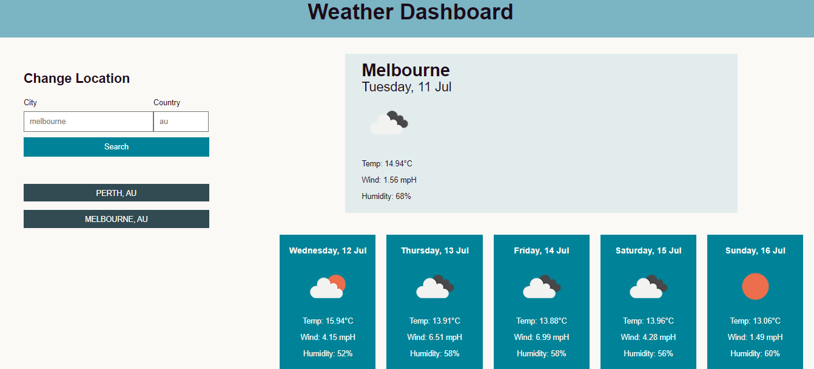

# YOUR WEATHER DASHBOARD

## DESCRIPTION

This weather dashboard application is a user friendly way to check the current weather and a 5 day forecast for any major city around the world. It displays the location, date, wind speed, temperature, humidity, and a weather icon to represent the overall weather conditions for each day. Search results are saved and displayed to the user to allow quick access to display the weather at these locations.

### Features
This application uses
* Day.js library to format the date to display to the user
* jQuery library within the script
* Open Weather API to pull the weather data
* Open Weather Geolocation API to convert a location into longitute and latitude as required with the Open Weather API
* Local Storage is used to store and display recent search results
* Additionally, the HTML and CSS has been validated with no issues through W3C's validation service.

## Visuals

The visual appearance of the application is shown below.

## Installation

N/A

## Usage 

The deployed application can be viewed by visiting the [deployed application here]()

This application can be run and used within a web browser. A user can input a location to search for the current and future weather. To pull accurate data for a location, a user must input both the name of the city, and the country code in the two labeled input fields. The country code must be in ISO 1366 format, which is an international standard to represent a given country. Users can search for a countries code by visiting the [ISO.org website](https://www.iso.org/iso-3166-country-codes.html)

## Support

For any support please submit a GitHub issue through this repository.

## Roadmap

Future considerations would be to improve the format in which a user's location is entered so that the city and country codes can be filtered through an autocompletion API.

## Contribution

Not currently accepting any contribution for this project.

## Authors and Acknowledgment

This application was completed by myself as part of my Monash University Full Stack Flex Bootcamp.

## License 

MIT License

## Project Status

Current project status is complete.
